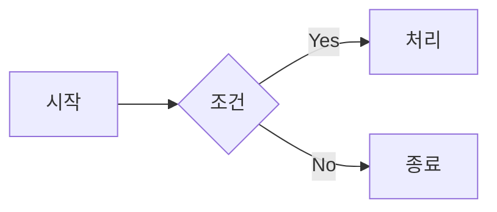

# DC Markdown Poster - Chrome Extension

디시인사이드에서 마크다운과 Mermaid 다이어그램을 예쁘게 게시할 수 있는 크롬 확장 프로그램입니다.

## 기능

- ✅ 마크다운 → HTML 변환 (제목, 굵게, 기울임, 링크, 이미지 등)
- ✅ 코드 블록 문법 강조 (highlight.js)
- ✅ Mermaid 다이어그램 → SVG 렌더링
- ✅ 테이블 지원
- ✅ 실시간 미리보기
- ✅ 인라인 스타일 적용 (디시인사이드 호환)

## 설치 방법

1. Chrome에서 `chrome://extensions` 접속
2. 우측 상단 "개발자 모드" 활성화
3. "압축해제된 확장 프로그램을 로드합니다" 클릭
4. 이 폴더(`dc-markdown-poster`)를 선택

## 사용 방법

1. 디시인사이드 글쓰기 페이지 접속 (예: https://gall.dcinside.com/board/write/?id=programming)
2. 우측 하단 `📝 MD` 버튼 클릭
3. 마크다운 에디터에서 내용 작성
4. 우측 패널에서 미리보기 확인
5. "변환 후 삽입" 버튼 클릭
6. 글 작성 완료 후 게시

## 지원 문법

### 기본 문법
```markdown
# 제목 1
## 제목 2
### 제목 3

**굵게** *기울임* ~~취소선~~

- 목록 1
- 목록 2

1. 번호 목록
2. 항목

> 인용문

[링크](https://example.com)

```

### 코드 블록
````markdown
```javascript
console.log('Hello, World!');
```
````

### Mermaid 다이어그램
````markdown

````

### 테이블
```markdown
| 열1 | 열2 | 열3 |
|-----|-----|-----|
| 값1 | 값2 | 값3 |
```

## 아이콘 설정

현재 placeholder 아이콘이 설정되어 있습니다. 커스텀 아이콘을 사용하려면:

1. 16x16, 48x48, 128x128 크기의 PNG 이미지 준비
2. `assets/icons/` 폴더에 각각 `icon16.png`, `icon48.png`, `icon128.png`로 저장

## 알려진 제한사항

- 서버 측 HTML 필터링으로 일부 스타일이 제거될 수 있음
- 매우 복잡한 Mermaid 다이어그램은 렌더링이 느릴 수 있음

## 라이선스

MIT
