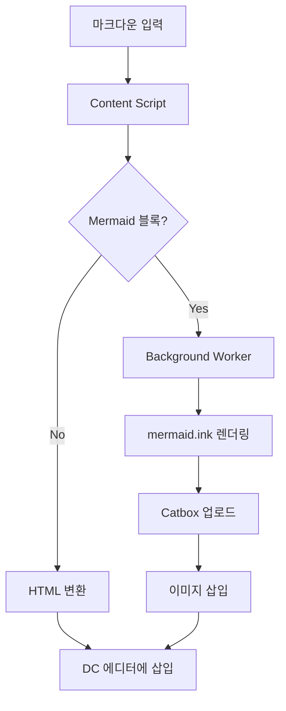
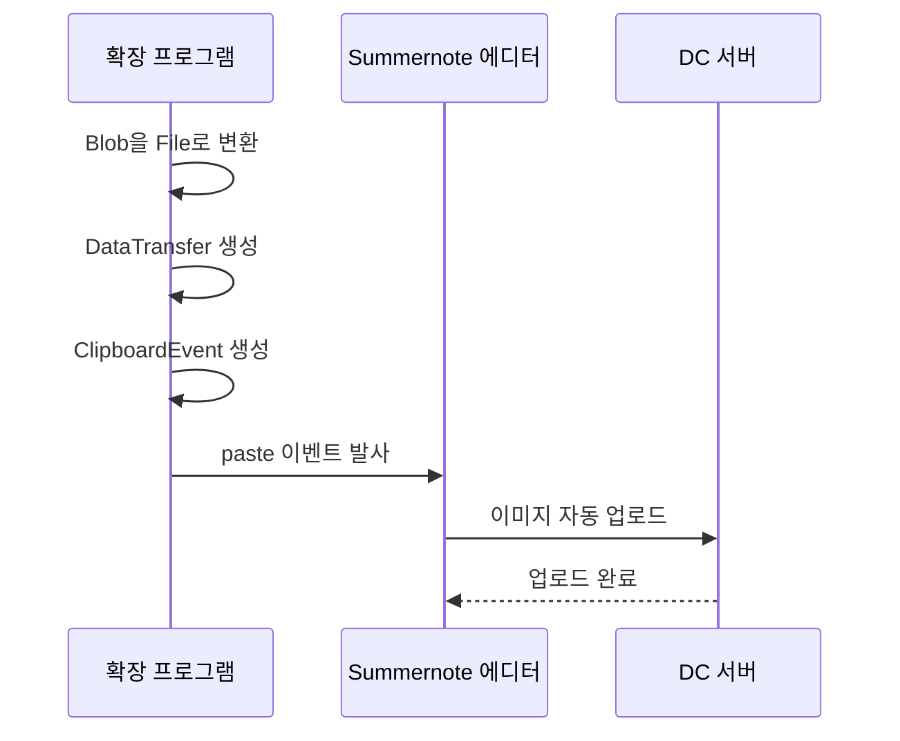

# DC Markdown Poster

디시인사이드에서 마크다운과 Mermaid 다이어그램을 예쁘게 게시할 수 있는 Chrome 확장 프로그램

---

## 1. 개요 및 용도

### 왜 만들었나?

디시인사이드는 기본 에디터가 HTML 기반이라 코드 블록, 테이블, 다이어그램 같은 기술 콘텐츠를 올리기가 어렵습니다. 특히 특이점이온다 갤러리에서 코드 공유할 때 줄바꿈이 깨지거나, 구문 강조가 안 되는 문제가 있었습니다.

이 확장 프로그램을 사용하면:

- 마크다운으로 글 작성 → 자동으로 디시 호환 HTML로 변환
- 코드 블록에 구문 강조 적용
- Mermaid 다이어그램을 이미지로 변환하여 삽입
- 테이블, 인용문, 목록 등 깔끔하게 렌더링

### 주요 기능

| 기능 | 설명 |
|------|------|
| 마크다운 변환 | 제목, 굵게, 기울임, 링크, 이미지 등 |
| 코드 하이라이팅 | 50개 이상 언어 구문 강조 |
| Mermaid 다이어그램 | flowchart, sequence, class diagram 등 |
| 테이블 | GFM 테이블 지원 |
| 인라인 스타일 | 디시인사이드 필터 우회 |

---

## 2. 설치 방법

1. 이 레포지토리를 다운로드 (Code → Download ZIP)
2. 압축 해제
3. Chrome에서 chrome://extensions 접속
4. 우측 상단 "개발자 모드" 활성화
5. "압축해제된 확장 프로그램을 로드합니다" 클릭
6. 압축 해제한 폴더 선택

설치 후 Chrome 우측 상단에 MD 아이콘이 보이면 성공!

---

## 3. 사용 방법

1. 디시인사이드 글쓰기 페이지 접속
2. 우측 하단 MD 버튼 클릭
3. 마크다운 에디터에서 내용 작성
4. "변환 후 삽입" 버튼 클릭
5. 글 작성 완료 후 게시

### 지원 문법

- 제목: # 제목1, ## 제목2, ### 제목3
- 강조: 별표 두개로 굵게, 별표 하나로 기울임
- 목록: 하이픈으로 시작
- 인용: 꺽쇠로 시작
- 코드블록: 백틱 세개 + 언어명
- 다이어그램: 백틱 세개 + mermaid
- 테이블: 파이프로 구분

---

## 4. 핵심 기술

### 기술 스택

- Chrome Extension Manifest V3
- 마크다운 파서: marked
- 구문 강조: highlight.js
- 다이어그램: mermaid.ink API
- 압축: pako (deflate)
- 이미지 호스팅: Catbox.moe

### 아키텍처 개요

Content Script에서 마크다운을 HTML로 변환하고, Mermaid 다이어그램은 Background Service Worker를 통해 mermaid.ink에서 이미지로 렌더링한 후 Catbox.moe에 업로드합니다.

---

### 핵심 기술 1: Blob Paste Injection

디시인사이드는 외부 이미지 URL을 직접 삽입할 수 없고, 반드시 자체 서버에 업로드해야 합니다.

해결책: 사용자가 이미지를 붙여넣기할 때 Summernote 에디터가 자동으로 업로드하는 동작을 역이용!

1. Blob을 File 객체로 변환
2. DataTransfer 객체 생성 (클립보드 시뮬레이션)
3. 가짜 ClipboardEvent 생성
4. Summernote 에디터에 이벤트 발사

에디터가 "사용자가 이미지 붙여넣기 했네?" 라고 착각하고 자동으로 DC 서버에 업로드합니다.

왜 이게 중요한가?

- DC 서버 업로드 API를 직접 호출할 필요 없음
- 인증 토큰, CSRF 등 복잡한 보안 처리 우회
- 에디터의 기존 업로드 로직을 그대로 활용

---

### 핵심 기술 2: Mermaid 다이어그램 렌더링

문제: 디시인사이드에서는 JavaScript 실행이 불가능하여 클라이언트 렌더링 불가

해결: mermaid.ink 서버 렌더링 + Catbox.moe 이미지 호스팅

1. Mermaid 코드를 JSON으로 래핑
2. Pako로 압축 (URL 길이 줄이기)
3. Base64 URL-safe 인코딩
4. mermaid.ink URL 생성
5. Background Worker에서 이미지 fetch 후 Catbox에 업로드

왜 Background Worker가 필요한가?

- Content Script는 CORS 정책에 묶임
- Background Service Worker는 host_permissions으로 CORS 우회 가능

---

### 핵심 기술 3: 디시인사이드 HTML 필터 우회

문제: 디시는 style 태그와 대부분의 CSS 클래스를 필터링

해결: 인라인 스타일로 모든 스타일 적용

class 속성이나 style 태그 대신, 각 요소에 직접 style 속성으로 스타일을 적용합니다.

---

### 핵심 기술 4: 한글 텍스트 전처리

문제: Mermaid 파서가 따옴표 없는 한글을 제대로 처리 못함

해결: 전처리기로 한글 텍스트 자동 따옴표 처리

노드 라벨에 한글이 포함되어 있으면 자동으로 따옴표를 추가합니다.

---

## 5. 개발 팁

### Manifest V3 Service Worker 주의점

Service Worker는 유휴 시 자동 종료되므로, 비동기 응답을 위해 onMessage 핸들러에서 반드시 return true를 해야 합니다.

### 디버깅 팁

- Content Script 로그: 페이지 F12 Console
- Service Worker 로그: chrome://extensions에서 "서비스 워커" 클릭
- 네트워크 요청: F12 Network 탭

---

## 6. 파일 구조

- manifest.json: Chrome 확장 설정
- background.js: Service Worker (Cross-origin 요청)
- popup/: 확장 팝업 UI
- content/: 에디터 UI, 다이어그램 처리
- utils/: 핵심 로직 (converter, mermaid-handler, paste-injector 등)
- lib/: 외부 라이브러리 (pako, marked, highlight.js)

---

## 7. 알려진 제한사항

| 제한 | 우회 방법 |
|------|----------|
| 서버 필터링 | 인라인 스타일 사용 |
| 복잡한 다이어그램 | 단순화 권장 |
| 모바일 앱 | 웹에서 확인 |

---

## 8. 라이선스

MIT License

사용된 오픈소스: marked, highlight.js, pako, mermaid

---

Made for DC 특이점이온다 갤러리
