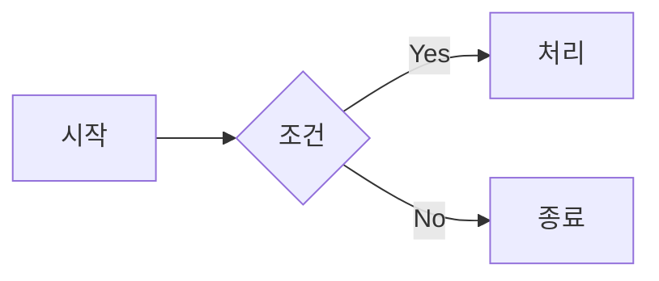
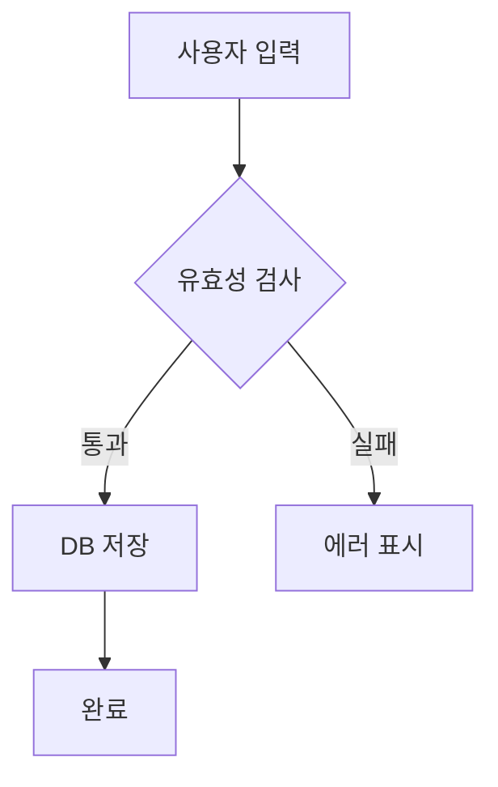
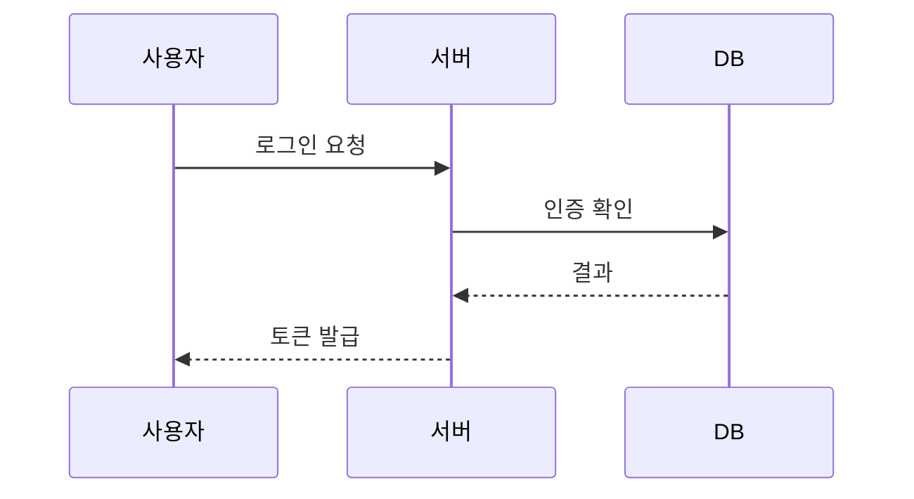

# DC Markdown Poster

> 디시인사이드에서 마크다운과 Mermaid 다이어그램을 예쁘게 게시할 수 있는 Chrome 확장 프로그램

<p align="center">
  
</p>

---

## 1. 개요 및 용도

### 왜 만들었나?

디시인사이드는 기본 에디터가 HTML 기반이라 **코드 블록, 테이블, 다이어그램** 같은 기술 콘텐츠를 올리기가 어렵습니다. 특히 프로그래밍 갤러리에서 코드 공유할 때 줄바꿈이 깨지거나, 구문 강조가 안 되는 문제가 있었습니다.

이 확장 프로그램을 사용하면:
- **마크다운으로 글 작성** → 자동으로 디시 호환 HTML로 변환
- **코드 블록에 구문 강조** 적용 (highlight.js)
- **Mermaid 다이어그램**을 이미지로 변환하여 삽입
- **테이블, 인용문, 목록** 등 깔끔하게 렌더링

### 주요 기능

| 기능 | 설명 |
|------|------|
| 마크다운 → HTML | 제목, 굵게, 기울임, 링크, 이미지 등 |
| 코드 하이라이팅 | 50+ 언어 구문 강조 (highlight.js) |
| Mermaid 다이어그램 | flowchart, sequence, class diagram 등 |
| 테이블 | GitHub Flavored Markdown 테이블 |
| 실시간 미리보기 | 작성하면서 결과 확인 |
| 인라인 스타일 | 디시인사이드 필터 우회 |

---

## 2. 설치 방법

### Chrome 개발자 모드로 설치

```
1. 이 레포지토리를 다운로드 (Code → Download ZIP)
2. 압축 해제
3. Chrome에서 chrome://extensions 접속
4. 우측 상단 "개발자 모드" 활성화
5. "압축해제된 확장 프로그램을 로드합니다" 클릭
6. 압축 해제한 폴더 선택
```

### 확인

설치 후 Chrome 우측 상단 확장 프로그램 아이콘에 📝 MD가 보이면 성공!

---

## 3. 사용 방법

### 기본 사용법

1. **디시인사이드 글쓰기 페이지** 접속
   - 예: `https://gall.dcinside.com/board/write/?id=programming`

2. 우측 하단 **📝 MD 버튼** 클릭

3. 마크다운 에디터에서 내용 작성

4. 우측 패널에서 **실시간 미리보기** 확인

5. **"변환 후 삽입"** 버튼 클릭

6. 글 작성 완료 후 게시

### 지원 문법

#### 기본 마크다운

```markdown
# 제목 1
## 제목 2
### 제목 3

**굵게** *기울임* ~~취소선~~

- 목록 1
- 목록 2

1. 번호 목록
2. 항목

> 인용문

[링크](https://example.com)

```

#### 코드 블록 (구문 강조)

````markdown
```javascript
function hello() {
    console.log('Hello, DC!');
}
```

```python
def greet():
    print("안녕하세요!")
```
````

#### Mermaid 다이어그램

````markdown

````

#### 테이블

```markdown
| 언어 | 특징 | 난이도 |
|------|------|--------|
| Python | 쉬움 | ★☆☆ |
| Rust | 안전함 | ★★★ |
| Go | 빠름 | ★★☆ |
```

---

## 4. 제작 과정 및 방법론

### 기술 스택

```
프레임워크: Chrome Extension Manifest V3
마크다운 파서: marked.min.js
구문 강조: highlight.min.js
다이어그램: Mermaid.js (mermaid.ink API 사용)
압축: pako.min.js (deflate)
이미지 호스팅: Catbox.moe
```

### 아키텍처

```
┌─────────────────────────────────────────────────────────┐
│                    Content Script                        │
│  ┌──────────────┐  ┌──────────────┐  ┌──────────────┐  │
│  │ Markdown     │  │ Mermaid      │  │ Style        │  │
│  │ Converter    │  │ Handler      │  │ Injector     │  │
│  └──────────────┘  └──────────────┘  └──────────────┘  │
│           │                │                 │          │
│           └────────────────┼─────────────────┘          │
│                            │                            │
│                            ▼                            │
│                    ┌──────────────┐                     │
│                    │  Paste       │                     │
│                    │  Injector    │                     │
│                    └──────────────┘                     │
└────────────────────────────┬────────────────────────────┘
                             │ chrome.runtime.sendMessage
                             ▼
┌─────────────────────────────────────────────────────────┐
│               Background Service Worker                  │
│                                                          │
│  ┌────────────────────────────────────────────────────┐ │
│  │  Cross-Origin Request Handler                      │ │
│  │  • mermaid.ink → 이미지 fetch                      │ │
│  │  • Catbox.moe → 이미지 업로드                      │ │
│  └────────────────────────────────────────────────────┘ │
└─────────────────────────────────────────────────────────┘
```

### 핵심 구현 포인트

#### 1. Mermaid 다이어그램 렌더링

**문제**: 디시인사이드에서 JavaScript 실행이 불가능하여 클라이언트 렌더링 불가

**해결**: mermaid.ink 서버 렌더링 + Catbox.moe 이미지 호스팅

```javascript
// 1. Mermaid 코드를 압축 (Pako deflate)
const payload = JSON.stringify({ code: mermaidCode, mermaid: { theme: 'default' } });
const compressed = pako.deflate(payload);

// 2. Base64 URL-safe 인코딩
const encoded = btoa(binary).replace(/\+/g, '-').replace(/\//g, '_');

// 3. mermaid.ink URL 생성
const url = `https://mermaid.ink/img/pako:${encoded}`;

// 4. Background Worker에서 이미지 fetch → Catbox 업로드
// (CORS 우회를 위해 Service Worker 사용)
```

#### 2. 디시인사이드 HTML 필터 우회

**문제**: 디시는 `<style>` 태그와 대부분의 CSS 클래스를 필터링

**해결**: 인라인 스타일로 모든 스타일 적용

```javascript
// ❌ 이렇게 하면 필터링됨
<div class="code-block">...</div>

// ✅ 인라인 스타일로 우회
<div style="background:#1e1e1e; padding:12px; border-radius:4px;">...</div>
```

#### 3. 한글 처리

**문제**: Mermaid 파서가 따옴표 없는 한글을 제대로 처리 못함

**해결**: 전처리기로 한글 텍스트 자동 따옴표 처리

```javascript
// 입력: A[시작] --> B{조건}
// 변환: A["시작"] --> B{"조건"}

function preprocessKorean(code) {
    // 한글 포함 노드 라벨에 따옴표 추가
    result = result.replace(/\[([^\]"]+)\]/g, (match, content) => {
        if (/[가-힣]/.test(content)) {
            return `["${content}"]`;
        }
        return match;
    });
    // ...
}
```

### 알면 좋은 팁

#### Manifest V3 Service Worker 주의점

```javascript
// Service Worker는 유휴 시 자동 종료됨
// 메시지 응답을 위해 return true 필수!

chrome.runtime.onMessage.addListener((request, sender, sendResponse) => {
    handleAsync(request).then(sendResponse);
    return true; // ← 이거 빼먹으면 응답 안 옴!
});
```

#### Catbox.moe API 사용법

```javascript
// 파일 업로드
const formData = new FormData();
formData.append('reqtype', 'fileupload');
formData.append('fileToUpload', blob, 'image.png');

const response = await fetch('https://catbox.moe/user/api.php', {
    method: 'POST',
    body: formData
});
// 응답: https://files.catbox.moe/abc123.png
```

#### 디버깅 팁

```
1. Content Script 로그 → 페이지 F12 Console
2. Service Worker 로그 → chrome://extensions → "서비스 워커" 클릭
3. 네트워크 요청 → F12 Network 탭에서 mermaid.ink, catbox.moe 확인
```

---

## 5. 파일 구조

```
dc-markdown-poster/
├── manifest.json          # Chrome 확장 설정 (Manifest V3)
├── background.js          # Service Worker (Cross-origin 요청)
├── popup/
│   ├── popup.html         # 확장 팝업 UI
│   └── popup.js           # 팝업 로직
├── content/
│   └── content.js         # 에디터 UI, 이벤트 핸들링
├── utils/
│   ├── mermaid-handler.js # ★ Mermaid → 이미지 변환
│   ├── converter.js       # ★ 마크다운 → HTML 변환
│   ├── paste-injector.js  # 클립보드 붙여넣기
│   └── style-injector.js  # 인라인 스타일 생성
├── lib/
│   ├── pako.min.js        # 압축 라이브러리
│   ├── marked.min.js      # 마크다운 파서
│   └── highlight.min.js   # 구문 강조
├── editor/
│   └── editor.css         # 에디터 스타일
└── assets/icons/          # 확장 아이콘
```

---

## 6. 스크린샷 및 데모

### 에디터 화면

> 💡 마크다운 에디터는 글쓰기 페이지 우측 하단 버튼으로 열립니다

```
┌─────────────────────────────────────────────────────────┐
│  DC Markdown Poster                              [X]    │
├─────────────────────────┬───────────────────────────────┤
│                         │                               │
│   # 제목                │   제목                        │
│                         │   ━━━━━━                      │
│   **굵은 글씨**         │   굵은 글씨                   │
│                         │                               │
│   ```python             │   ┌──────────────────────┐   │
│   print("Hello")        │   │ print("Hello")       │   │
│   ```                   │   └──────────────────────┘   │
│                         │                               │
│   [입력창]              │   [미리보기]                  │
├─────────────────────────┴───────────────────────────────┤
│              [변환 후 삽입]    [취소]                    │
└─────────────────────────────────────────────────────────┘
```

### 지원 다이어그램 예시

#### Flowchart


#### Sequence Diagram


---

## 7. 알려진 제한사항

| 제한 | 설명 | 우회 방법 |
|------|------|----------|
| 서버 필터링 | 일부 스타일이 제거될 수 있음 | 인라인 스타일 사용 |
| 다이어그램 크기 | 매우 복잡한 다이어그램은 느림 | 단순화 권장 |
| 모바일 앱 | 디시 앱에서 일부 깨질 수 있음 | 웹에서 확인 |
| URL 길이 | 2000자 초과 시 Catbox 업로드 필요 | 자동 처리됨 |

---

## 8. 기여 및 라이선스

### 기여하기

```bash
git clone https://github.com/YOUR_USERNAME/dc-markdown-poster.git
cd dc-markdown-poster
# 수정 후 PR 보내주세요!
```

### 사용된 오픈소스

- [marked](https://github.com/markedjs/marked) - MIT License
- [highlight.js](https://github.com/highlightjs/highlight.js) - BSD 3-Clause
- [pako](https://github.com/nodeca/pako) - MIT License
- [mermaid](https://github.com/mermaid-js/mermaid) - MIT License

### 라이선스

MIT License - 자유롭게 사용, 수정, 배포 가능합니다.

---

<p align="center">
  <strong>Made with ❤️ for DC 프갤러들</strong>
</p>
