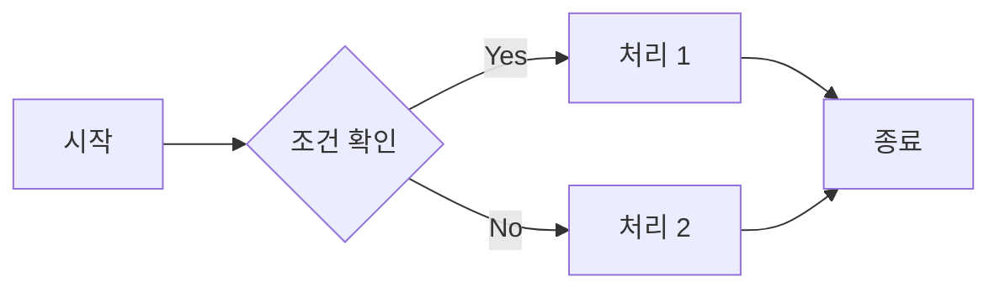
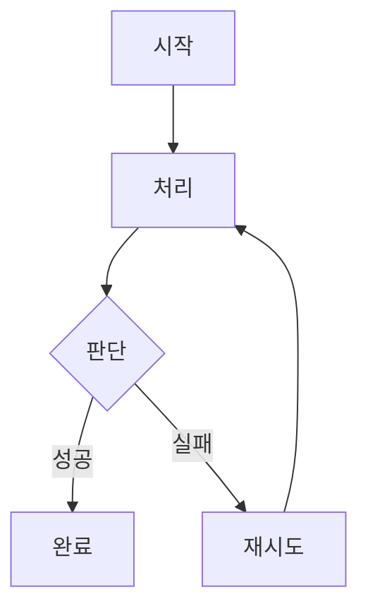
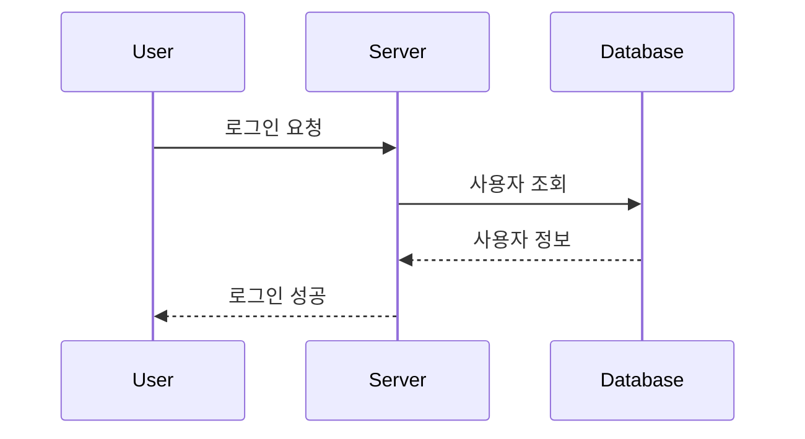

<p align="center">
  
</p>

<h1 align="center">DC Markdown Poster</h1>

<p align="center">
  <strong>디시인사이드에서 마크다운과 Mermaid 다이어그램을 예쁘게 게시하세요</strong>
</p>

<p align="center">
  <a href="#"></a>
  <a href="#"></a>
  <a href="#"></a>
  <a href="#license"></a>
</p>

<p align="center">
  <a href="#주요-특징">특징</a> •
  <a href="#설치-방법">설치</a> •
  <a href="#사용-방법">사용법</a> •
  <a href="#지원-문법">문법</a> •
  <a href="#테마">테마</a> •
  <a href="#기여-가이드">기여</a>
</p>

---

## 스크린샷

<!-- TODO: 실제 스크린샷으로 교체 -->
<p align="center">
  
</p>

<p align="center">
  <em>실시간 미리보기가 가능한 마크다운 에디터</em>
</p>

---

## 주요 특징

### v3.0.0 - ASCII/Unicode 렌더링 혁신

| 기능 | 설명 |
|------|------|
| **외부 의존성 제거** | 이미지 호스팅 불필요, DCInside 필터 완벽 우회 |
| **오프라인 동작** | 인터넷 연결 없이도 완전한 기능 제공 |
| **무제한 사용** | API 제한 없음, 원하는 만큼 사용 가능 |
| **즉시 렌더링** | 업로드 대기 시간 없이 실시간 변환 |

### 핵심 기능

- **마크다운 변환** - 제목, 굵게, 기울임, 링크, 이미지, 테이블 등 완벽 지원
- **코드 구문 강조** - Highlight.js 기반 다양한 언어 지원
- **Mermaid 다이어그램** - 플로우차트, 시퀀스 다이어그램을 ASCII/Unicode로 렌더링
- **실시간 미리보기** - 입력과 동시에 결과 확인
- **다양한 테마** - Light, Dark, Cyber 등 6가지 프리셋
- **풍부한 툴바** - 10개 이상의 빠른 삽입 버튼

---

## ASCII 렌더링 예시

### 플로우차트 (Flowchart)

```
╔═══════════════════╗        ╭───────────╮        ╔═══════════════════╗
║   ●  시작         ║ ═════▶ │   처리    │ ═════▶ ║   완료  ✓         ║
╚═══════════════════╝        ╰───────────╯        ╚═══════════════════╝
```

### 시퀀스 다이어그램 (Sequence Diagram)

```
┌──────┐           ┌────────┐           ┌────────┐
│ User │           │ Server │           │   DB   │
└─┬────┘           └───┬────┘           └───┬────┘
  │                    │                    │
  │   요청 메시지       │                    │
  ├───────────────────▶│                    │
  │                    │   쿼리 실행         │
  │                    ├───────────────────▶│
  │                    │◀╌╌╌╌╌╌╌╌╌╌╌╌╌╌╌╌╌┤
  │                    │                    │
```

---

## 설치 방법

### Chrome 개발자 모드 설치

1. **저장소 다운로드**
   ```bash
   git clone https://github.com/your-username/dc-markdown-poster.git
   ```
   또는 ZIP 파일 다운로드 후 압축 해제

2. **Chrome 확장 프로그램 페이지 접속**
   ```
   chrome://extensions
   ```

3. **개발자 모드 활성화**
   - 우측 상단의 "개발자 모드" 토글 활성화

4. **확장 프로그램 로드**
   - "압축해제된 확장 프로그램을 로드합니다" 클릭
   - 다운로드한 `dc-markdown-poster` 폴더 선택

5. **설치 완료!**
   - 브라우저 우측 상단에 확장 프로그램 아이콘 확인

---

## 사용 방법

### 기본 사용법

1. **디시인사이드 글쓰기 페이지 접속**
   ```
   https://gall.dcinside.com/board/write/?id=YOUR_GALLERY
   ```

2. **에디터 열기**
   - 우측 하단의 `📝 MD` 버튼 클릭
   - 또는 팝업에서 "에디터 열기" 버튼 클릭

3. **마크다운 작성**
   - 좌측 패널에서 마크다운 입력
   - 우측 패널에서 실시간 미리보기 확인

4. **변환 및 삽입**
   - "변환 후 삽입" 버튼 클릭 (또는 `Ctrl+Enter`)
   - 디시인사이드 에디터에 자동 삽입

### 키보드 단축키

| 단축키 | 기능 |
|--------|------|
| `Ctrl + B` | 굵게 |
| `Ctrl + I` | 기울임 |
| `Ctrl + Enter` | 변환 후 삽입 |
| `ESC` | 에디터 닫기 |

### 툴바 버튼

| 버튼 | 기능 | 설명 |
|------|------|------|
| **B** | 굵게 | `**텍스트**` |
| *I* | 기울임 | `*텍스트*` |
| `⌘` | 인라인 코드 | `` `코드` `` |
| `#` | 링크 | `[텍스트](URL)` |
| H1~H3 | 제목 | `# ~ ###` |
| `•` | 순서 없는 목록 | `- 항목` |
| `1.` | 순서 있는 목록 | `1. 항목` |
| `❝` | 인용 | `> 인용문` |
| `{ }` | 코드 블록 | 언어별 구문 강조 |
| `◈` | Mermaid | 다이어그램 삽입 |
| `⊞` | 테이블 | 테이블 생성 |

---

## 지원 문법

### 기본 마크다운

```markdown
# 제목 1
## 제목 2
### 제목 3
#### 제목 4

**굵은 텍스트**
*기울임 텍스트*
***굵은 기울임***
~~취소선~~

- 순서 없는 목록
- 항목 2
  - 중첩 항목

1. 순서 있는 목록
2. 항목 2

> 인용문
> 여러 줄 가능

[링크 텍스트](https://example.com)


---
수평선
```

### 코드 블록

````markdown
```javascript
function hello() {
  console.log('Hello, DCInside!');
}
```

```python
def greet(name):
    print(f"안녕하세요, {name}!")
```
````

**지원 언어**: JavaScript, Python, TypeScript, HTML, CSS, JSON, SQL, Bash 등 다수

### 테이블

```markdown
| 이름 | 나이 | 직업 |
|------|------|------|
| 홍길동 | 25 | 개발자 |
| 김철수 | 30 | 디자이너 |
| 이영희 | 28 | 기획자 |
```

### Mermaid 다이어그램

#### 플로우차트 (좌우 방향)

````markdown

```mermaid
graph LR
  A[시작] --> B{조건 확인}
  B -->|Yes| C[처리 1]
  B -->|No| D[처리 2]
  C --> E[종료]
  D --> E
```
````

#### 플로우차트 (상하 방향)

````markdown

```mermaid
graph TB
  Start[시작] --> Process[처리]
  Process --> Decision{판단}
  Decision -->|성공| Success[완료]
  Decision -->|실패| Retry[재시도]
  Retry --> Process
```
````

#### 시퀀스 다이어그램

````markdown

```mermaid
sequenceDiagram
  participant User
  participant Server
  participant Database

  User->>Server: 로그인 요청
  Server->>Database: 사용자 조회
  Database-->>Server: 사용자 정보
  Server-->>User: 로그인 성공
```
````

---

## 테마

### 프리셋 테마

에디터 하단에서 테마를 선택할 수 있습니다.

| 테마 | 아이콘 | 설명 | 배경색 | 텍스트 색상 |
|------|--------|------|--------|-------------|
| **Light** | ☀️ | 밝고 깔끔한 스타일 | `#FAFAFA` | `#1a1a1a` |
| **Dark** | 🌙 | 다크 모드 (기본값) | `#1e1e1e` | `#d4d4d4` |
| **Cyber** | 💠 | 사이버펑크 스타일 | `#0d1117` | `#58a6ff` |
| **Purple** | 💜 | 보라색 그라데이션 | `#2d1b4e` | `#e9d5ff` |
| **Terminal** | 💚 | 터미널 스타일 | `#0c0c0c` | `#00ff00` |
| **Warm** | 🧡 | 따뜻한 톤 | `#1f1a14` | `#fbbf24` |

### 문자셋 옵션

| 옵션 | 설명 | 예시 |
|------|------|------|
| **Unicode** | 풍부한 그래픽 문자 | `╔═╗ ║ ╚═╝ ◆ ▶` |
| **ASCII** | 순수 ASCII 문자 | `+--+ | +--+ <> >` |
| **Cyber** | 특수 기호 조합 | `⟦═⟧ ║ ⟹ ◈ ✦` |
| **Block** | 블록 문자 | `█▀▌ ▛▜ ▙▟ ■` |

### 효과

| 효과 | 설명 |
|------|------|
| **None** | 효과 없음 |
| **Scanline** | CRT 모니터 스캔라인 효과 |
| **Terminal** | 터미널 글로우 효과 |

---

## 기술 스택

| 기술 | 용도 |
|------|------|
| **JavaScript (ES6+)** | 핵심 로직 |
| **Manifest v3** | Chrome 확장 프로그램 표준 |
| **Marked.js** | 마크다운 파싱 |
| **Highlight.js** | 코드 구문 강조 |
| **Pako** | 압축 라이브러리 |
| **Custom Mermaid ASCII Renderer** | 다이어그램 렌더링 엔진 (1,295줄) |

---

## 프로젝트 구조

```
dc-markdown-poster/
├── manifest.json           # Chrome 확장 프로그램 설정
├── popup/
│   ├── popup.html          # 팝업 UI
│   └── popup.js            # 팝업 로직
├── content/
│   └── content.js          # 콘텐츠 스크립트 (DCInside 주입)
├── utils/
│   ├── converter.js        # 마크다운 → HTML 변환
│   ├── mermaid-ascii.js    # ASCII 다이어그램 렌더러
│   └── mermaid-handler.js  # Mermaid 처리 핸들러
├── editor/
│   └── editor.css          # 에디터 스타일
├── lib/
│   ├── marked.min.js       # 마크다운 파서
│   ├── highlight.min.js    # 구문 강조
│   └── pako.min.js         # 압축 라이브러리
├── assets/
│   └── icons/              # 확장 프로그램 아이콘
└── test/
    └── *.html              # 테스트 파일
```

---

## 알려진 제한사항

- **Subgraph** - Mermaid subgraph 문법 미지원
- **Style/ClassDef** - Mermaid 스타일 정의 미지원
- **복잡한 분기** - 매우 복잡한 다이어그램은 단순화되어 표시
- **HTML 필터링** - 디시인사이드 서버 측 필터로 일부 스타일 제거 가능

---

## 버전 히스토리

| 버전 | 날짜 | 변경 사항 |
|------|------|-----------|
| **v3.0.0** | 2024 | ASCII/Unicode 렌더링, 6가지 프리셋 테마, Grid 레이아웃 엔진 |
| v2.x | - | 이미지 업로드 방식 (DCInside 필터로 차단됨) |
| v1.x | - | mermaid.ink API 방식 (URL 길이 제한) |

---

## 기여 가이드

기여를 환영합니다! 다음 단계를 따라주세요:

### 버그 리포트

1. [Issues](https://github.com/your-username/dc-markdown-poster/issues) 페이지에서 기존 이슈 확인
2. 새 이슈 생성 시 다음 정보 포함:
   - Chrome 버전
   - 확장 프로그램 버전
   - 재현 단계
   - 예상 동작 vs 실제 동작
   - 스크린샷 (있는 경우)

### Pull Request

1. **Fork** - 저장소 포크
2. **Branch** - 기능별 브랜치 생성
   ```bash
   git checkout -b feature/amazing-feature
   ```
3. **Commit** - 명확한 커밋 메시지 작성
   ```bash
   git commit -m "feat: 새로운 기능 추가"
   ```
4. **Push** - 브랜치 푸시
   ```bash
   git push origin feature/amazing-feature
   ```
5. **PR** - Pull Request 생성

### 커밋 메시지 규칙

| 접두사 | 용도 |
|--------|------|
| `feat:` | 새 기능 |
| `fix:` | 버그 수정 |
| `docs:` | 문서 수정 |
| `style:` | 코드 스타일 변경 |
| `refactor:` | 리팩토링 |
| `test:` | 테스트 추가/수정 |

---

## License

MIT License

```
MIT License

Copyright (c) 2024 DC Markdown Poster Contributors

Permission is hereby granted, free of charge, to any person obtaining a copy
of this software and associated documentation files (the "Software"), to deal
in the Software without restriction, including without limitation the rights
to use, copy, modify, merge, publish, distribute, sublicense, and/or sell
copies of the Software, and to permit persons to whom the Software is
furnished to do so, subject to the following conditions:

The above copyright notice and this permission notice shall be included in all
copies or substantial portions of the Software.

THE SOFTWARE IS PROVIDED "AS IS", WITHOUT WARRANTY OF ANY KIND, EXPRESS OR
IMPLIED, INCLUDING BUT NOT LIMITED TO THE WARRANTIES OF MERCHANTABILITY,
FITNESS FOR A PARTICULAR PURPOSE AND NONINFRINGEMENT. IN NO EVENT SHALL THE
AUTHORS OR COPYRIGHT HOLDERS BE LIABLE FOR ANY CLAIM, DAMAGES OR OTHER
LIABILITY, WHETHER IN AN ACTION OF CONTRACT, TORT OR OTHERWISE, ARISING FROM,
OUT OF OR IN CONNECTION WITH THE SOFTWARE OR THE USE OR OTHER DEALINGS IN THE
SOFTWARE.
```

---

<p align="center">
  Made with ❤️ for DCInside users
</p>
